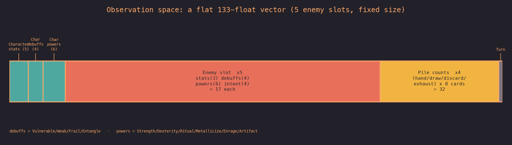
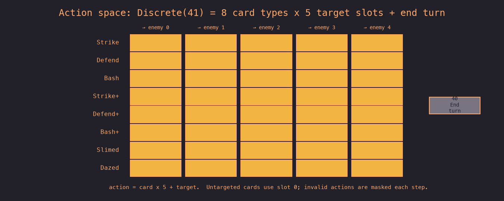

# Mini-Spire

[](https://github.com/rob-pitkin/mini-spire/actions/workflows/ci.yml)
[](#license)

A fast, open-source **Slay the Spire combat engine in C++ with a Gymnasium
Python API**, built as a research platform for benchmarking reinforcement
learning approaches on a roguelike deck-builder.

The engine is written in C++ for throughput (~145k env steps/sec on a laptop)
and exposed to Python via zero-copy pybind11 bindings, so you can train an agent
with [Stable-Baselines3](https://github.com/DLR-RM/stable-baselines3) and friends
using a standard Gymnasium interface — action masking included.


> **Read the intro write-up:** [Mini-spire: a fast Slay the Spire RL environment
> in C++](https://rhp.bearblog.dev) — the story, the design choices, and the M1
> result (a ~14.7k-parameter PPO agent that wins 100% of the time, trained in
> ~4 minutes on an M1 MacBook).

## Highlights

- ⚡ **Fast** — pure C++ combat engine, ~145k steps/sec single-env; ~4 min to
  train 1M timesteps on a CPU laptop, no GPU required.
- 🧩 **Zero-copy bindings** — observations are numpy views backed by C++ memory
  (pybind11 buffer protocol), no per-step allocation.
- 🎭 **Action masking from day one** — `action_masks()` in the convention
  [sb3-contrib `MaskablePPO`](https://sb3-contrib.readthedocs.io) expects.
- 🎲 **Deterministic & reproducible** — every shuffle and enemy move draws from a
  single seeded RNG, so any fight replays exactly from its seed.
- 🕹️ **Human-playable** — a `rich` terminal UI (`minispire-play`) with per-enemy
  ASCII avatars, intents, and status readouts: a faithful terminal Slay the
  Spire you can point at any Act 1 pool or custom deck.

## Scope

A **single combat encounter**, but the full Act 1 fight — no map, shops, or
relics (yet). The combat alone is a rich RL problem (energy management, card
sequencing, blocking vs. attacking, deck & enemy stochasticity, multi-enemy
targeting), and it now spans the whole Act 1 roster:

- **Every Act 1 enemy** — normal enemies, both slime sizes + splitting Large
  slimes, the 5-gremlin gang, and all three elites (Gremlin Nob, Lagavulin, the
  3 Sentries) — faithfully modeled from the wiki (Ascension 0): exact AI,
  HP ranges, moves, powers (Ritual, Metallicize, Enrage, Artifact), status
  cards (Slimed, Dazed), split/wake/enrage mechanics.
- **Faithful weighted encounter selection** — `reset()` samples an Act 1
  encounter from the real Weak / Strong / Elite pools (single enemies *and*
  multi-enemy groups).
- **Configurable** — pick the encounter pool and the player's deck at env
  construction, so it doubles as a pure combat sandbox.

Map traversal, card rewards, and relics are on the roadmap.

## Install

`uv` is the package manager. ([install uv](https://docs.astral.sh/uv/))

```bash
uv venv --python 3.12
uv pip install -e ".[dev]"        # engine + training + dev extras
uv run python -c "import minispire"
```

The C++ extension builds automatically via scikit-build-core on install. After
changing C++ sources, re-run `uv pip install -e .` to rebuild.

Requires Python 3.12, a C++17 compiler, and CMake ≥ 3.16.

## Quickstart

**Play a fight yourself** (terminal UI — a faithful terminal Slay the Spire):

```bash
uv run minispire-play 0                      # seed (positional, optional)
uv run minispire-play --pool elite 3         # draw an elite fight
uv run minispire-play --deck "strike,strike,strike,defend,bash"   # custom deck
uv run minispire-play --config fights/nob.yaml                    # saved scenario
```

Flags (`--pool weak|strong|elite`, `--deck`, `--seed`) are the quick path; a
`--config <yaml>` file (keys `seed` / `pool` / `deck`) is the reusable-scenario
layer, and CLI flags override it.

**Use the environment in Python** — it's a standard Gymnasium env:

```python
import numpy as np
from minispire.env import MinispireEnv
from minispire._core import EncounterPool, CardId

# Defaults to the Weak Act 1 pool + Ironclad starter deck. Configure both:
env = MinispireEnv(
    pool=EncounterPool.Elite,            # Weak / Strong / Elite
    deck=[CardId.Strike] * 4 + [CardId.Bash],   # or None for the starter
    hp_reward_coeff=0.5,                 # optional HP-retention shaping
)
obs, info = env.reset(seed=0)            # samples an encounter from the pool

done = False
while not done:
    mask = env.action_masks()            # bool[NUM_ACTIONS] of legal actions
    action = int(np.random.choice(np.flatnonzero(mask)))
    obs, reward, terminated, truncated, info = env.step(action)
    done = terminated or truncated
```

**Train a MaskablePPO agent** and evaluate it over a fixed seed set:

```bash
uv run minispire-train --config configs/baseline_sparse.yaml
uv run minispire-eval --checkpoint checkpoints/<run_id>/final.zip
```

Training logs to [Weights & Biases](https://wandb.ai) if configured (offline-safe
otherwise).

## Environment specification

**Observation** — a flat `float32[133]` vector, colored here by semantic group.
It's fixed-size: always 5 enemy slots (an `is_alive` flag zeroes empty/dead
ones), so the same vector fits a lone Cultist and a 5-slime swarm.



Statuses split into **debuffs** (Vulnerable/Weak/Frail/Entangle — tick down) and
**powers** (Strength/Dexterity/Ritual/Metallicize/Enrage/Artifact — persistent),
per entity. Pile slices are *counts per card type* (not ordered lists), so the
vector stays fixed-width and order-invariant — draw order is hidden, just as a
human sees only which cards are in a pile, not their order.

**Action** — `Discrete(41)`: an 8-card-type × 5-target-slot cross-product, plus
end-turn. `action = card × 5 + target`; untargeted cards (Defend) use slot 0.



Invalid actions (card not in hand, insufficient energy, dead target, or an
unplayable status card like Dazed) are masked each step; end-turn is always
legal. Obs/action sizes are exposed as `CombatEnv.OBS_SIZE` / `NUM_ACTIONS` so
they never drift.

**Reward** — `+1` win / `-1` loss, `0` otherwise. An optional terminal HP-shaping
bonus (`hp_reward_coeff * current_hp / max_hp`, added on a win) rewards winning
with more HP remaining; the default coefficient is `0` (pure sparse reward).

## Architecture

```
Python RL layer        (Stable-Baselines3 / sb3-contrib / custom)
      │
pybind11 boundary      (thin: reset, step, action_masks, clone)
      │
C++ combat engine      (CombatState, Card, Enemy, TurnLoop)
```

The C++ engine owns all game logic and knows nothing about Python or RL. The
pybind11 module exposes only the environment surface, with zero-copy observation
arrays. See [architecture.md](architecture.md) for detail.

## Project layout

```
src/         C++ engine — headers (.h) + implementations (.cc)
bindings/    pybind11 module (_core)
python/
  minispire/ public Python API: env.py (Gymnasium), play/train/eval entry points
  tests/     pytest suite
tests/       GoogleTest C++ unit tests
configs/     training configs (YAML)
analysis/    blog/figure-generation tooling
```

## Development

```bash
uv run pytest python/tests        # Python tests

cmake -S . -B build               # C++ build + GoogleTest
cmake --build build
ctest --test-dir build
```

## Roadmap

Phase 1 (a hard, faithful environment) is done: the full Act 1 combat roster,
multi-enemy fights, and weighted encounter selection. Next:

- **Throughput benchmark** — steps/sec vs. batch size, episode stats.
- **RL comparison** — PPO vs. DQN vs. MCTS on the fixed benchmark (`clone()`
  exists for MCTS).
- **Beyond combat** — larger card pool + card rewards, sequential fights, then
  Act 1 map generation and persisting state between fights.

Full detail in [roadmap.md](roadmap.md).

## Related work

- [Miles Oram (2024)](https://milesoram.github.io/slay-the-spire-ml-project.html)
  — full STS recreation in C++ with a DQN. The inspiration; mini-spire adds a
  clean Gymnasium API and an open, documented codebase.
- [PokeRL](https://drubinstein.github.io/pokerl/) — beating Pokémon Red with pure
  deep RL; the broader inspiration for RL-on-games on modest hardware.
- [gym-sts](https://github.com/kronion/gym-sts) — Gymnasium wrapper around the
  real game (requires a copy of STS as a `.jar`).

## License

MIT
