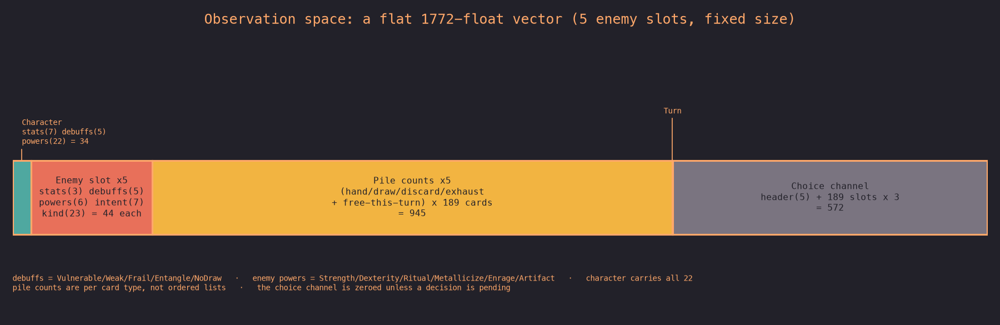
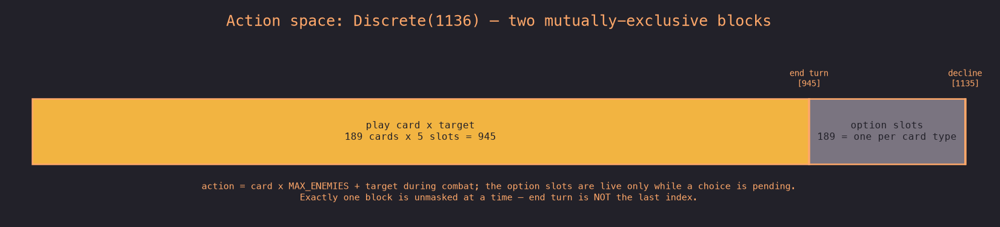
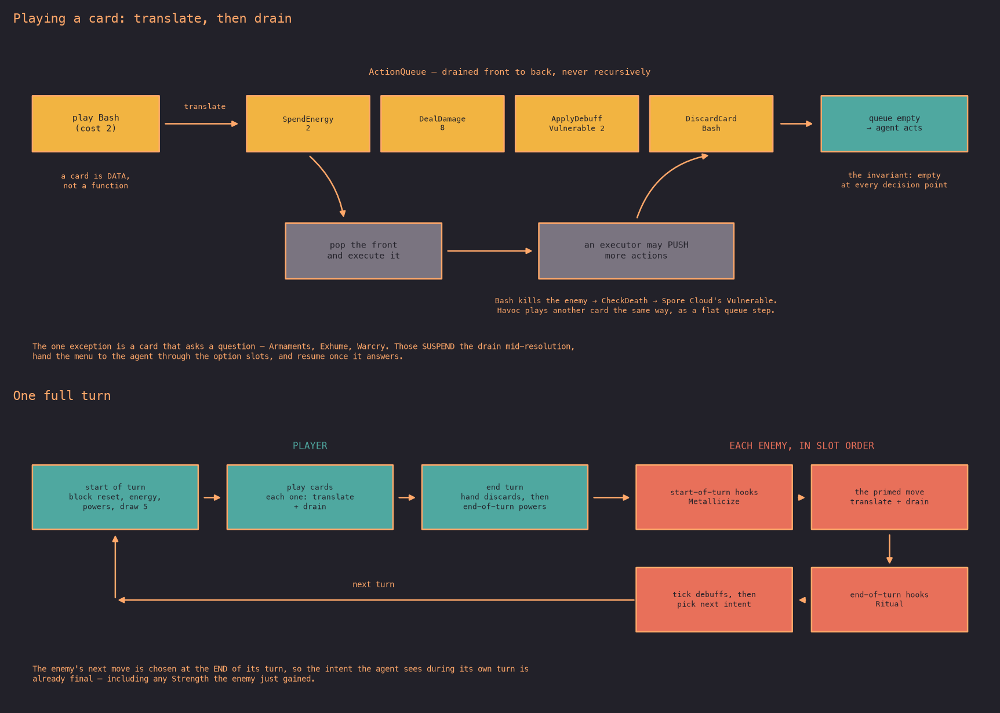

# Mini-Spire

[](https://github.com/rob-pitkin/mini-spire/actions/workflows/ci.yml)
[](#license)

A fast, open-source **Slay the Spire combat engine in C++ with a Gymnasium
Python API**, built as a research platform for benchmarking reinforcement
learning approaches on a roguelike deck-builder.

The engine is written in C++ for throughput and exposed to Python via zero-copy
pybind11 bindings, so you can train an agent with
[Stable-Baselines3](https://github.com/DLR-RM/stable-baselines3) and friends
using a standard Gymnasium interface — action masking included.


> **Read the intro write-up:** [Mini-spire: a fast Slay the Spire RL environment
> in C++](https://rhp.bearblog.dev) — the story, the design choices, and the M1
> result (a ~14.7k-parameter PPO agent that wins 100% of the time, trained in
> ~4 minutes on an M1 MacBook).

## Highlights

- ⚡ **Fast** — the whole engine is C++ with no Python in the step loop, so
  training runs on a CPU laptop without a GPU.
- 🧩 **Zero-copy bindings** — observations are numpy views backed by C++ memory
  (pybind11 buffer protocol), no per-step allocation.
- 🎭 **Action masking from day one** — `action_masks()` in the convention
  [sb3-contrib `MaskablePPO`](https://sb3-contrib.readthedocs.io) expects.
- 🎲 **Deterministic & reproducible** — every shuffle and enemy move draws from a
  single seeded RNG, so any fight replays exactly from its seed.
- 🕹️ **Human-playable** — a `rich` terminal UI (`minispire-play`) with per-enemy
  ASCII avatars, intents, and status readouts: a faithful terminal Slay the
  Spire you can point at any Act 1 pool or custom deck.

## Scope

A **single combat encounter**, but the full Act 1 fight — no map, shops, or
relics (yet). The combat alone is a rich RL problem (energy management, card
sequencing, blocking vs. attacking, deck & enemy stochasticity, multi-enemy
targeting), and it now spans the whole Act 1 roster:

- **The complete Ironclad card pool** — every card the character can play, from
  Strike to Corruption, including the awkward ones: cards that pause to ask you
  a question (Armaments, Exhume, Dual Wield), cards that play other cards
  (Havoc, Double Tap), cards that grow as you use them (Rampage, Searing Blow),
  and the powers with their real trigger orders (Combust, Juggernaut, Rupture,
  Corruption).
- **Every Act 1 enemy** — normal enemies, both slime sizes + splitting Large
  slimes, the 5-gremlin gang, and all three elites (Gremlin Nob, Lagavulin, the
  3 Sentries) — faithfully modeled from the wiki (Ascension 0): exact AI,
  HP ranges, moves, powers (Ritual, Metallicize, Enrage, Artifact), status
  cards (Slimed, Dazed), split/wake/enrage mechanics.
- **Verified against the wiki, card by card** — the whole pool and the whole
  enemy roster were reviewed against the Slay the Spire wiki in one pass, and
  the deliberate divergences that remain are written down rather than assumed.
- **Faithful weighted encounter selection** — `reset()` samples an Act 1
  encounter from the real Weak / Strong / Elite pools (single enemies *and*
  multi-enemy groups).
- **Configurable** — pick the encounter pool and the player's deck at env
  construction, so it doubles as a pure combat sandbox.

Map traversal, card rewards, and relics are on the roadmap.

## Install

`uv` is the package manager. ([install uv](https://docs.astral.sh/uv/))

```bash
uv venv --python 3.12
uv pip install -e ".[dev]"        # engine + training + dev extras
uv run python -c "import minispire"
```

The C++ extension builds automatically via scikit-build-core on install. After
changing C++ sources, re-run `uv pip install -e .` to rebuild.

Requires Python 3.12, a C++17 compiler, and CMake ≥ 3.16.

## Quickstart

**Play a fight yourself** (terminal UI — a faithful terminal Slay the Spire):

```bash
uv run minispire-play 0                      # seed (positional, optional)
uv run minispire-play --pool elite 3         # draw an elite fight
uv run minispire-play --deck "strike,strike,strike,defend,bash"   # custom deck
uv run minispire-play --config fights/nob.yaml                    # saved scenario
```

Flags (`--pool weak|strong|elite`, `--deck`, `--seed`) are the quick path; a
`--config <yaml>` file (keys `seed` / `pool` / `deck`) is the reusable-scenario
layer, and CLI flags override it.

**Use the environment in Python** — it's a standard Gymnasium env:

```python
import numpy as np
from minispire.env import MinispireEnv
from minispire._core import EncounterPool, CardId

# Defaults to the Weak Act 1 pool + Ironclad starter deck. Configure both:
env = MinispireEnv(
    pool=EncounterPool.Elite,            # Weak / Strong / Elite
    deck=[CardId.Strike] * 4 + [CardId.Bash],   # or None for the starter
    hp_reward_coeff=0.5,                 # optional HP-retention shaping
)
obs, info = env.reset(seed=0)            # samples an encounter from the pool

done = False
while not done:
    mask = env.action_masks()            # bool[NUM_ACTIONS] of legal actions
    action = int(np.random.choice(np.flatnonzero(mask)))
    obs, reward, terminated, truncated, info = env.step(action)
    done = terminated or truncated
```

**Train a MaskablePPO agent** and evaluate it over a fixed seed set:

```bash
uv run minispire-train --config configs/baseline_sparse.yaml
uv run minispire-eval --checkpoint checkpoints/<run_id>/final.zip
```

Training logs to [Weights & Biases](https://wandb.ai) if configured (offline-safe
otherwise).

## Environment specification

**Observation** — a flat `float32` vector, colored below by what each region
means. The guiding principle is that the agent sees what a human player sees:
the shuffle order of the draw pile and the RNG state stay hidden, but everything
on screen is available. The vector's size is a consequence of that, not a target.



Its shape never changes between encounters. There are always five enemy slots,
with absent or dead ones zeroed behind an `is_alive` flag, so a lone Cultist and
a five-slime swarm produce the same vector and a policy carries over between
them. Statuses are split into debuffs, which tick down each turn, and powers,
which persist; enemy slots carry only the powers an enemy can have, while the
character carries the full set. Card piles appear as counts per card type rather
than ordered lists, which mirrors what a player actually knows — you can open
your draw pile and see that it holds two Strikes and a Bash, but not which one
you'll draw next.

Roughly a third of the vector is given over to the choice channel, because Slay
the Spire keeps interrupting a turn to ask something. Armaments upgrades a card
you choose; Exhume returns one from the exhaust pile; Warcry, Headbutt and Dual
Wield all pause mid-resolution to offer a menu. Those menus are part of the game
state, so they live in the observation, with one slot per card type — enough
that the options can never overflow, since a pile may legitimately hold every
distinct card in a deck. The block sits at zero for most of a fight, which is
the price of never having to truncate a menu a human would see in full.

Cards that accumulate state carry it in their identity rather than in a hidden
counter. Rampage grows permanently each time it is played, so two copies in hand
might be worth 8 and 23 damage; each step of that growth is its own card type,
which keeps the copies distinguishable in the observation and separately
selectable as actions. Rampage's growth and Searing Blow's upgrades are both
capped at a realistic ceiling — a fixed-length vector can't enumerate an
unbounded ladder, and the caps sit well beyond what a single combat reaches. The
engine keeps counting past them internally, so damage stays exact even where the
encoding stops distinguishing.

**Action** — two mutually exclusive blocks: play a card, or answer the question
currently on screen.



In normal play the agent picks a card and a target — `action = card ×
MAX_ENEMIES + target`, with untargeted cards like Defend using slot 0 — and only
that block is legal. While a choice is pending the situation reverses: the card
actions are masked off entirely and only the option slots are available. Indices
are stable across states, so a given action always means the same card, and a
policy learns a fixed vocabulary instead of relearning it each turn.

Invalid actions are masked every step: cards not in hand, insufficient energy,
dead targets, and unplayable Status cards like Dazed.

**Reward** — `+1` win / `-1` loss, `0` otherwise. An optional terminal HP-shaping
bonus (`hp_reward_coeff * current_hp / max_hp`, added on a win) rewards winning
with more HP remaining; the default coefficient is `0` (pure sparse reward).

## Architecture

```
Python RL layer        (Stable-Baselines3 / sb3-contrib / custom)
      │
pybind11 boundary      (thin: reset, step, action_masks, clone)
      │
C++ combat engine      (CombatState, Card, Enemy, TurnLoop)
```

The C++ engine owns all game logic and knows nothing about Python or RL. The
pybind11 module exposes only the environment surface, with zero-copy observation
arrays.

Inside the engine, a card is data rather than a function. Playing one doesn't
mutate the game directly; it translates into a list of small actions that are
pushed onto a queue and then drained one at a time.



The reason for the indirection is that Slay the Spire's effects interrupt each
other constantly, and doing that with nested function calls means holding a
half-finished card resolution open while the game state changes underneath it.
On a queue those interruptions are just more entries. Bash kills an enemy, so
the damage executor pushes a death check, which pushes Spore Cloud's Vulnerable;
Havoc plays the top card of your draw pile, and that nested play is a flat queue
step rather than a recursive call. Nothing is ever mid-resolution while
something else runs.

The queue is empty every time the agent is asked for an action, which is what
makes a step boundary meaningful. The exception is deliberate: a card like
Armaments needs an answer before it can finish, so it suspends the drain, offers
the menu through the option slots, and resumes once the agent has chosen.

Turn order follows the same pattern. The player's turn opens and closes with
drained batches of effects, then each enemy acts in slot order — its
start-of-turn powers, its move, its end-of-turn powers — and picks its next
intent before the player sees anything. That last detail matters more than it
looks: because the choice happens at the end of the enemy's turn, the intent
displayed during your turn is already final, including any Strength the enemy
gained on the way.

See [architecture.md](architecture.md) for detail.

## Project layout

```
src/         C++ engine — headers (.h) + implementations (.cc)
bindings/    pybind11 module (_core)
python/
  minispire/ public Python API: env.py (Gymnasium), play/train/eval entry points
  tests/     pytest suite
tests/       GoogleTest C++ unit tests
configs/     training configs (YAML)
analysis/    blog/figure-generation tooling
```

## Development

```bash
uv run pytest python/tests        # Python tests

cmake -S . -B build               # C++ build + GoogleTest
cmake --build build
ctest --test-dir build
```

## Roadmap

Phase 1 (a hard, faithful environment) is done: the complete Ironclad card pool,
the full Act 1 combat roster, multi-enemy fights, and weighted encounter
selection. Next:

- **Throughput benchmark** — steps/sec vs. batch size, episode stats, measuring
  the engine rather than the Python harness around it.
- **RL comparison** — PPO vs. DQN vs. MCTS on the fixed benchmark (`clone()`
  exists for MCTS).
- **Beyond combat** — card rewards, sequential fights, then Act 1 map generation
  and persisting state between fights.

Full detail in [roadmap.md](roadmap.md).

## Related work

- [Miles Oram (2024)](https://milesoram.github.io/slay-the-spire-ml-project.html)
  — full STS recreation in C++ with a DQN. The inspiration; mini-spire adds a
  clean Gymnasium API and an open, documented codebase.
- [PokeRL](https://drubinstein.github.io/pokerl/) — beating Pokémon Red with pure
  deep RL; the broader inspiration for RL-on-games on modest hardware.
- [gym-sts](https://github.com/kronion/gym-sts) — Gymnasium wrapper around the
  real game (requires a copy of STS as a `.jar`).

## License

MIT
