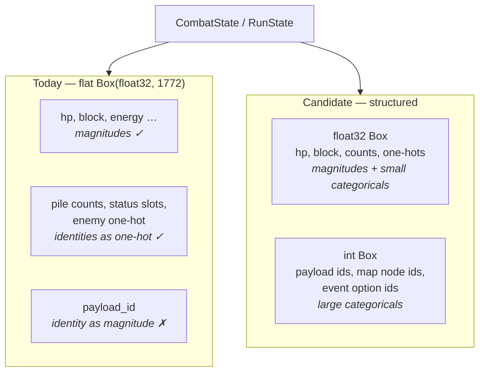

# v2 observation / decision-point — raw hunting notes

> **These notes are now CLOSED for hunting.** The scope decision below was taken
> from them on 2026-08-13, and the implementable spec lives in
> [`v2-spec.md`](v2-spec.md). Keep this file as the record of *why* — it holds
> the attacks, the debate, the prior art, and the several places a confident
> claim turned out to be wrong on checking.

---

## SCOPE DECIDED (2026-08-13)

**v2.0.0 is a complete Act 1 run**, and Rob has flagged this as a natural
stopping point for the project as a research artifact — further acts and
mechanics are optional follow-on work, not a commitment.

### In scope

Full Act 1: 15 map floors + the boss · path choice · card rewards · shops ·
rest sites · Act 1 events · potions · relics · Neow's blessing · colorless cards
and curses in the card vocabulary.

### The exclusion list collapsed

Scoping to Act 1 removed the worst findings **for free**:

**All boss relics are structurally absent.** Runic Dome, Astrolabe, Empty Cage,
Busted Crown and Sozu are boss relics, offered only *after* an act boss. A run
that ends at the Act 1 boss never plays with one. That removes conditional
observability (Runic Dome) and two of three multi-select cases at no cost, and
also removes the boss-relic pick as a decision point.

Most of the rest turned out to be cheap rather than hard:

| relic | feared | actual |
|---|---|---|
| Question Card | reward-shape change | size the reward block at 4 |
| Singing Bowl | non-entity option | one extra action index |
| Prayer Wheel | second reward screen | free — phases already persist |
| Girya / Peace Pipe / Shovel | rest overflow | size rest at 6 |
| Potion Belt | slot overflow | free under count-vector potions |
| Wing Boots | breaks edge determinism | edges are observation, legality is the mask, relics-held is observable — include |

### Shape-breakers: AUTO-RESOLVE, not exclude

**Ruled (Rob):** where a decision breaks the action shape, the *engine* resolves
it by a fixed deterministic policy and the agent never sees it. Prior art does
this. It keeps the content in the game — the event still occupies a floor and
consumes a room — where excluding it would change the run's distribution.

| case | why it breaks | resolution |
|---|---|---|
| **Match and Keep!** (shrine) | duplicate entities, face-down, 5-step | engine picks at random; no agent decision |
| **Gambling Chip** (rare relic) | multi-select subset | engine applies a fixed policy (discard nothing) |
| **Frozen Eye** (shop relic) | conditional observability — *informational*, so auto-resolve does not apply | **excluded from the shop pool.** The only true exclusion. |

The cost: a human would make these choices and the agent does not, so it
is a bounded parity divergence. It is documented rather than hidden, and it is
strictly smaller than removing the content.

### Deferred, with the shape reserved

Acts 2–4 · boss relics · Frozen Eye · **multi-select as a decision shape**.

That last one matters: **reserve the shape even though nothing in v2.0.0 uses
it.** It is the one mechanism that would be genuinely painful to retrofit, and
designing for v1 alone is the exact mistake `decision-points.md` records making
once already.

---


**Status: EXPLORATORY. Nothing here is decided.** These are attacks on the
existing spec, written down as found. Solving them individually is explicitly
not the goal — the goal is one mechanism general enough to cover all of them.

Working constraint (Rob, 2026-08-09): *"we do need a solution generic enough
that one size can fit all."*

---

## Attack 1 — `payload_id` starts mattering exactly when it becomes wrong

**Status: real. Highest confidence of the lot.**

ROB-89 accepted `payload_id` as a known wart: a categorical encoded as a
magnitude, which is the same modelling error `observation-space.md` §5.2 rejects
sts2-rl-agent for. The acceptance rested on it being *bounded* —
`decision-points.md`: "one float per slot, in a channel that is fully masked off
during ordinary combat."

It is bounded **because it is currently unused.** For card choices the slot
index already carries identity, so `payload_id` is written as zero. In v2 it
becomes the *primary* identity encoding for map nodes, shop items and event
options, where no slot-index redundancy exists.

So the justification and the cost never overlap in time. It was cheap while
unused, and becomes the main encoding for three of the five new decision types.

The doc names its own revisit trigger — "if v2's decision types turn out not to
need the shared channel, or if training shows the choice channel is where a
policy is losing" — and neither clause covers this case: the wart's *scope*
grows rather than its cost.

Also worth re-deriving rather than inheriting: the fix that would have worked
(index option slots by `CardId`) was rejected **for v2's sake** — it traded
generality that had not been used yet for a v1 improvement. That reasoning was
correct then. The generality is now being used, so the trade is no longer
the same trade.

**Direction to explore, not a decision:** only one `ChoiceKind` is ever live.
Payload could be a small one-hot over a **per-kind vocabulary** (a map node has
≤7 types; a shop ≤10 slots) rather than a magnitude over a global id space. Cheap
precisely because non-card decisions have small option sets — the 189 slots exist
only because a card pile may hold every card type.

## Shop and relic/potion vocabularies — researched, numbers were wrong

Confirmed against [the Merchant page](https://slaythespire.wiki.gg/wiki/Merchant)
and [Relics](https://slaythespire.wiki.gg/wiki/Relics). Earlier estimates in
these notes said "~50?" for relics; that was badly off and it moves the
arithmetic.

### A shop is a fixed 14-slot menu

| slot group | count | notes |
|---|---:|---|
| coloured cards | 5 | always 2 Attack, 2 Skill, 1 Power; one has a 50% discount |
| colourless cards | 2 | 1 Uncommon, 1 Rare; cost 20% more |
| potions | 3 | |
| relics | 3 | rightmost is **always** a Shop relic — the only source of those |
| card removal | 1 | once per shop |
| **total** | **14** | |

**This is much better news than "shops are unbounded".** The menu is a fixed
shape, so a shop is expressible as a fixed action block where the *slot group*
is stable even if contents vary — slot 7 is always a potion. That is strictly
stronger than pure rank-indexing.

### But three findings complicate it

1. **Stock is fixed on entry — except with the Courier relic**, which restocks
   an item when bought. So "the menu is static during a visit" is
   relic-dependent, and Attack 2's chain problem is real rather than avoidable.
2. **Prices are state-dependent, not static.** Membership Card halves them;
   Smiling Mask fixes removal at 50; Ascension 16 adds 10%. So a slot's cost is
   computed, like `effective_cost` in combat — which the design already has a
   pattern for.
3. **Card-removal price is persistent run state**: starts at 75 gold and
   **increases by 25 each time it is used, across the whole run**. That is a new
   piece of run state nobody had listed, and it is exactly the kind of thing that
   would have been discovered late.

### Vocabulary sizes

| entity | count | confidence |
|---|---:|---|
| cards (frozen) | 189 | ✅ exact |
| relics obtainable by Ironclad | **~170** | ⚠️ wiki gives ~185–200 total across characters, with ~11 Ironclad-exclusive; the Ironclad-reachable subset is an estimate |
| potions | ~50 | ⚠️ wiki gives no total; 3 Ironclad-exclusive + neutrals. **Not confirmed.** |
| potion *slots* held | 3 | ✅ (2 at Ascension 11, more with Potion Belt) |

**Relics being ~170 rather than ~50 is the significant correction.** It does not
break entity-indexing, but it triples that part of the vocabulary.

### Revised arithmetic for stable entity-indexed actions

| block | size |
|---|---:|
| combat (card × target) | 945 |
| map positions | ~105 |
| event options | ~60 |
| card selection (rewards, removal, shop cards) | 189 |
| relic selection | ~170 |
| potion selection | ~50 |
| rest options | ~3 |
| end turn, decline | 2 |
| **total** | **~1,524** |

Against **1,136** today — about 34% growth for permanently stable action
semantics. Still a flat `Discrete`, still masked, still tractable.

### A decision type nobody listed: using a potion

Potions are usable **in combat and out of it** — an action live in two phases,
which was on the "not yet hunted" list. With only 3 held slots, "use potion in
slot k" is 3 actions and slot-indexing is natural here (you hold at most 3),
unlike everywhere else where rank-indexing is the defect. Worth noting the
asymmetry rather than applying one rule everywhere.

## Three decision points nobody had listed

The working set was five: card reward, path, shop, event, rest. Research turned
up three more, and one of them changes the model.

### 6. Neow's blessing — a decision at floor 0

[Neow](https://slaythespire.wiki.gg/wiki/Neow) offers a choice **before the
first combat**: two options after a poor previous run, otherwise four, drawn
from distinct categories — card manipulation (remove / transform / upgrade /
obtain), resources (HP, gold, potions, a random common relic), a
drawback-paired-with-a-stronger-boon, and *replace your starter relic with a
boss relic*.

Structurally this is an **event** — heterogeneous options with no natural
identity — so whatever solves events solves Neow. The blessing list is fixed and
enumerable, so `(blessing_id)` indexing works.

It also means **a run does not start in combat**, which the walking skeleton in
`roadmap.md` assumes.

### 7. Post-combat rewards are a SEQUENCE, not an event

This is the one that changes the model. After a fight:

| | normal | elite | boss (Act 1–2) |
|---|---|---|---|
| gold | automatic | 25–35, automatic | automatic |
| relic | — | **automatic**, random | — |
| card reward | pick 1 of 3, **skippable** | pick 1 of 3 | pick 1 of 3 **rare** |
| boss relic | — | — | **pick 1 of 3** |
| potion | sometimes | sometimes | sometimes |

So a boss produces **two consecutive choices** (rare card, then boss relic), and
gold/relic arrive with no decision at all.

**The generalisation:** a *phase* is not a single decision. Shops have up to 14
purchases, rewards have 1–2 choices, combat has many turns. A phase is a **mode
that persists across steps**, with a varying set of legal actions inside it —
which is exactly how combat already works. That is reassuring: the model already
expresses this, and Attack 2's "shops are a chain" is not special-cased. It is
the normal case, and combat was the precedent all along.

### 8. Boss relic choice

Pick 1 of 3 boss relics — a distinct entity space from ordinary relics
(boss relics are ~26 across characters). Enumerable, so it folds into relic
indexing.

## On Courier — do not cut it

Rob offered Courier as the one parity difference if it complicated shops. **It
does not, and the offer should be declined.**

Courier restocks a slot when bought. Under a fixed-14-slot encoding the slots
stay 14 and only their *contents* change — and the observation is re-read every
step regardless. What Courier breaks is the assumption "stock is static during a
visit", which nothing in the design relied on.

The real complication is **multiple purchases per visit**, which is core Slay
the Spire and exists with or without Courier. Cutting Courier would buy nothing
and spend a parity difference for it.

## Attack 2 — shops are a chain, not a choice

**Status: probably real; a control-flow question, not an encoding one.**

The *shape* fits: a sequence of "pick one of N" plus a "leave" option. What may
not fit is the engine's model. Today a `PendingChoice` resolves once and the
drain continues. A shop needs a choice that **re-opens after resolving**, N
times, with affordability changing between iterations because gold was spent.

Open: does `PendingChoice` express "ask again"? Rest sites do not need this
(one choice), events mostly do not, card rewards do not. Shops and possibly
multi-card events do.

## Map structure — researched, my assumptions were wrong

From [Map Generation](https://slaythespire.wiki.gg/wiki/Map_Generation).

Settled against the [reference implementation](https://github.com/Ru5ty0ne/sts_map_oracle)
(`src/main.rs`), which is authoritative where the wiki was ambiguous:

```rust
let map_height   = 15;
let map_width    = 7;
let path_density = 6;
```

| | value | note |
|---|---|---|
| grid | **15 × 7 = 105 positions** | ✅ from the generator |
| path density | 6 | **this is the "up to six locations per floor" the wiki mentions — it is the PATH COUNT, not the grid width** |
| floors per act | 17 | 1–15 are the grid, 16 is the boss, 17 is the boss chest (not on the map) |
| edges | 1–3 in *and* 1–3 out | except top/bottom floors |

⚠️ **I got this wrong once in these notes** — read "up to six locations" as the
width and revised 105 down to 91. A reviewer pushed back and the generator
settles it: 105 is right. Recorded because the wiki phrasing is genuinely
misleading and the next person will make the same mistake.

**Fixed floors:** 1 = easy combat, 9 = treasure, 15 = rest, 16 = boss. Those four
are deterministic and arguably need not be encoded at all — though encoding them
costs nothing and avoids a special case.

**Room types (7):** Normal 53%, Elite 8%, Rest 12%, Merchant 5%, Unknown 22%,
plus Treasure and Boss on their fixed floors.

Not every grid position holds a room ("up to six"), so the type one-hot needs an
**eighth value for "no room here"** rather than a separate existence flag.

### The parity trap: Unknown rooms must stay Unknown

**Map generation does not decide what an Unknown room becomes.** The type is
rolled *when the player enters it*. A human sees `?` on the map and cannot know
whether it is a Monster, Merchant, Treasure or Event.

So the observation **must encode Unknown as Unknown**. Encoding the resolved type
would be a parity violation *in the other direction* — giving the agent strictly
more than a human has, which §1 forbids just as firmly as giving it less.

This is easy to get wrong in implementation, because the engine will know the
answer as soon as it rolls it. It must not be rolled until entry, or must not be
exposed until entry. Worth a test.

### Map cost, settled

| block | size | note |
|---|---:|---|
| node type per position | **840** | 105 × 8 (7 room types + "no room here") |
| out-edges | **315** | 105 × 3; edges only reach columns c-1, c, c+1 |
| **visited path** | **105** | see below — a parity gap, not optional |
| current position | **7** | column only; the floor is already a run scalar, so 105 double-encoded it |
| **total** | **1267** | |

Two changes from a reviewer, both accepted:

- **Position 105 → 7.** Position is `(floor, column)` and floor is already in the
  run scalars. Encoding the full 105 one-hot restated it. Lossless, −98 floats.
- **`visited` plane added (+105).** StS highlights the path you have walked and
  greys out unreachable nodes. A human sees this. Reachability is *derivable*
  from edges + position only by graph propagation, which an MLP cannot do in a
  forward pass — so leaving it out is a parity gap, not a saved float.

## Attack 3 — the map is terrain, not a decision

**Status: real, and it does not fit the framing at all.**

Path choice *as an action* is trivially "pick one of 2–4 exits". But a path's
value depends on rooms several floors ahead, so the observation needs the
**whole map** — roughly 15 floors × up to 7 nodes, with room types.

This is the largest single obs addition in v2, and the "the channel absorbs it"
story does not apply, because the map is not a choice. It is **terrain the
choice is made against**. Card piles are the closest existing analogue: standing
state the agent reads, not options it selects.

Consequence: v2's obs work splits in two. Decision *content* flows through the
channel; **persistent run state** (deck, potions, gold, map) is a separate
addition and is where the real growth is.

## Attack 4 — non-enumerable event payloads

**Status: real but probably small.**

Events offer options that are neither cards nor objects with ids: "gain 100
gold", "lose 8 HP", "fight the boss now". These need a vocabulary of their own.

Probably tractable — the set of event-option *kinds* is small and closed even
though the numbers vary. Related to Attack 1: whatever solves per-kind payload
vocabularies likely solves this too.

## Attack 5 — two-phase decisions

**Status: probably already handled.**

Smithing at a rest site is "pick smith, then pick a card". Precedented by combat
targeting and by Armaments, and the TUI already models two-phase selection
(`app.py` holds the pending card while the target is chosen). Noting it so it is
not rediscovered.

---

## DECIDED — phase indicator in the observation

**Locked (Rob, 2026-08-12).** A one-hot over the current phase: combat /
card-reward / map / shop / event / rest. Six floats.

Without it the same option slot means different things in contexts the agent
cannot distinguish, which is a §1.1 aliasing defect — two states that look
identical and behave differently. It is also the cheapest fix in the design.

Note this is *not* the same as `ChoiceKind` in the choice header. `ChoiceKind`
says which kind of card-choice is pending during combat; the phase says which
screen the player is on. In v2 they are different axes.

## Not yet hunted

- **Relics.** Deliberately out of the current five, but they modify *everything*
  and are the obvious next addition. A design that cannot absorb them is
  probably wrong.
- **Potions.** Usable at almost any point, including mid-combat — an action
  available in two different phases. Does the action space fork by phase?
- **Card removal / transform at shops** — picking from the *deck*, which can
  exceed the option-slot count if a deck grows past `kNumCardTypes` distinct
  cards. Probably safe (slots == 189 == every distinct card) but worth checking.
- **Whether the phase itself needs to be in the observation.** If the agent
  cannot tell "I am in a shop" from "I am in an event", the same option slot
  means different things. Currently `ChoiceKind` is in the header — check it
  generalises.

## From first principles: what an observation actually encodes

Before comparing container formats, the distinction that drives everything:

### Magnitudes and identities are different kinds of number

| | magnitude | identity |
|---|---|---|
| example | HP = 52, block = 8, energy = 3 | CardId 47, map node type, shop item |
| is `n+1` near `n`? | **yes** — 52 HP is one worse than 53 | **no** — card 47 is not "between" 46 and 48 |
| is arithmetic meaningful? | yes — `hp/max_hp` is a real quantity | no — `(card47 + card48)/2` is nonsense |
| what the network should learn | a smooth response over the range | an independent response per value |

A neural network reading a float slot **assumes magnitude**. Its first layer
computes `w · x`, so inputs that are numerically close produce similar
activations. That is exactly right for HP and exactly wrong for a card id.

**Putting an identity in a float slot tells the network something false**, and
it's false in a way that costs sample efficiency: the network must spend
capacity learning to *undo* an ordering the observation asserted.

### The three ways to encode an identity

Given a vocabulary of `V` possible values, encoding one identity:

```
(a) ONE-HOT                 V floats, exactly one hot
    card 47 of 189   ->  [0, 0, ... , 1, ... , 0]
                                       ^ index 47
    truthful: no two values are "close"
    cost: V floats per value encoded

(b) INTEGER + EMBEDDING     1 integer slot; policy learns a vector per value
    card 47 of 189   ->  47   ->  [policy's learned 32-d vector]
    truthful: the embedding table has no built-in ordering
    cost: 1 slot; requires the consumer to know it is categorical

(c) RAW SCALAR              1 float, the id as a number
    card 47 of 189   ->  47.0
    FALSE: asserts 47 is near 46 and far from 3
    cost: 1 slot, and a lie
```

Our observation already uses **(a)** nearly everywhere — pile planes are counts
per card type, statuses are per-effect slots, enemy kind is a one-hot (ROB-96).
`payload_id` is the one place using **(c)**, which is precisely what ROB-89
recorded as the known wart.

NLE uses **(b)** throughout, at a vocabulary of 5991.

### Why the container format follows from this

The reason (b) is unavailable to us today is not philosophical — it is that a
`Box(float32)` **cannot express "this slot is categorical."** An integer stored
in a float32 is indistinguishable from a magnitude; the type carries no signal,
so no consumer can know to embed it.

That is the actual argument for a structured observation. Not "Dict is tidier",
but: *a single-dtype flat vector is expressively incapable of distinguishing the
two kinds of number, and we have both.*



### The cost that makes this a real decision

One-hot is truthful but its cost is `slots × vocabulary`:

Current `OBS_SIZE` is **1772**, which is the number to measure against:

| what | slots | vocabulary | one-hot cost | vs whole obs | integer cost |
|---|---:|---:|---:|---:|---:|
| option payloads, per-kind vocab | 189 | ~16 | 3,024 | **1.7×** | 189 |
| option payloads, global vocab | 189 | ~250 | 47,250 | **26.7×** | 189 |
| map nodes (Act 1: ~15 floors × 7) | ~105 | ~7 | 735 | 0.4× | 105 |

(Figures computed against the live constants, not estimated.)

So:

- **Per-kind vocabularies make one-hot affordable in absolute terms** but it is
  not free: 3,024 floats is 1.7× the *entire current observation*, spent on a
  channel that is zeroed for most of a fight. That is the same "the block sits
  at zero for most of a fight" trade the choice channel already made once —
  making it twice deserves argument, not just arithmetic.
- **A global vocabulary is out** (47k). This is what `decision-points.md`
  computed when it rejected one-hot — note it computed against `kNumCardTypes`,
  i.e. the global case, which is the expensive one. The per-kind case was never
  costed.
- **Integers are ~free in the observation** but push the work to the policy.

### The argument that settles the remit objection

`decision-points.md` rejected embeddings because "policy architecture is outside
the environment's remit" (`observation-space.md` §1). That objection applies to
*mandating* an embedding. It does not apply to *typing the data honestly*:

> An integer categorical is **strictly more informative** than the same value in
> a float slot. A policy can always one-hot an integer itself; it cannot recover
> categorical-ness from a float.

So exposing identities as integers does not dictate architecture — it removes a
lie and lets the policy choose. A `Box(float32)` forces the environment to pick
one-hot-or-lie on the policy's behalf, which is the more architectural decision.

**Still undecided.** The per-kind one-hot option keeps the flat contract and is
affordable, so "structured observation" is not automatically the answer — it is
the answer if we also want the map, which is where one-hot costs stack.

## The debate: unified vs phase-split

Two agents argued opposite sides, each briefed to advocate rather than balance.
Their arguments are summarised below; **claims marked ✅ were verified against
the repo afterwards**, because an advocate's citation is a lead, not a fact.

### The convergent finding — worth more than either argument

Both sides, independently, found the same structural inconsistency:

✅ **`decision-points.md:25` states the intended solvers are "PPO for combat, an
LLM for non-combat decisions."** ✅ Lines 305–309 then use that assumption to
excuse the positional-slot weakness: positional slots are hard for an MLP but
are a "self-describing menu" for an LLM.

✅ **`roadmap.md` (written later, this month) says v2 "does not need a second
action space, a second network, or a macro/micro split."**

So Attack 1 was under-stated. `payload_id` was not merely accepted as *bounded* —
it was accepted under a **solver assumption that the roadmap silently
withdrew**. The interface and its justification have come apart, and this must
be settled deliberately whichever way the debate lands.

They disagree only about which side gives:

- *Split:* the roadmap withdrew a premise while keeping the interface it paid
  for. Restore the premise.
- *Unified:* the roadmap is right; §6's premise should be **retired explicitly**
  rather than quietly inherited.

### The case for phase-split

- ✅ The v1.0.0 obs (1772) is frozen, shipped to PyPI, and is what M2's published
  numbers were measured against. A split reuses it byte-for-byte and regresses
  throughput by zero, by construction.
- **~1007 of 1772 floats (57%) are dead at a shop** — the entire enemy block,
  status slots, energy, four of five pile planes. Symmetrically, a unified vector
  carries ~934 added floats (+53%) on every *combat* step to serve non-combat
  decisions.
- **Step ratio ≈ 5:1.** Act 1 is ~9 fights × ~18 steps ≈ 162 combat steps against
  ~32 non-combat decisions. The +53% is paid on 83% of steps to serve 17% of
  decisions.
  - ⚠️ The agent cited R6 as "≤10% regression against 438k engine". **R6 actually
    reads "≤10% regression vs. 838k engine steps/sec"** — a baseline that no
    longer exists; the engine measures 438k today after the observation widened.
    So R6 is itself stale and needs rebasing regardless of this debate. The
    *argument* (a wider obs threatens a published number) stands; the citation
    did not.
- **Credit assignment is better, not worse, under a split.** Framed as an SMDP
  over decision points, a card reward sits ~30 meta-steps from the boss rather
  than ~200 env-steps: `0.99³⁰ = 0.74` versus `0.99²⁰⁰ = 0.13`, a ~5.5× stronger
  signal on the decisions that matter most.
- **Not Miles's architecture.** His macro net had a separate observation that
  *omitted run context* — an interface defect with a cheap fix (append a ~30-float
  run-context block to the combat obs). And his limitation is **reported, never
  measured**; no ablation exists. The split is the control condition that makes
  "unified is better" a publishable claim for M3.
- Search over meta, learning inside combat, is the AlphaGo shape, and `clone()`
  exists for it.
  - ⚠️ The agent quoted "`clone()` at 2.28 µs/step". **Unverified** — the
    benchmark records `apply_action_us: 1.551`, which is not clone cost, and
    `clone()` is not benchmarked at all. If rollout-based meta search becomes a
    serious option, measure it first.

### The case for unified

- ✅ **`decision-points.md:96` records sts2-rl-agent: `Discrete(100)` full run
  spanning map, rewards, shop, rest and potions, MaskablePPO, ~92% Act 1 win
  rate** — and our own doc calls it "a *unified* flat run-space demonstrably
  works for exactly our roadmap." The only system in our prior-art table that
  completes runs is the unified one; the split one is Miles's, which needed a
  *third* model to bridge a seam it introduced.
  - *Caveat I add:* Rob rejected sts2's **observation encoding**
    (categorical-as-scalar, §5.2), which is independent of its **unified
    structure**. The evidence survives that objection.
- ✅ **`observation-space.md` §1.1 makes aliasing a defect.** Two combats with
  identical hands and enemies, one with a campfire next floor and one with the
  Act 1 boss, demand different HP risk — and a human makes that call *inside* the
  fight. Excluding run context from combat is textbook aliasing, and §1's answer
  to "the obs gets big" is already written: if a human sees it, size is the price.
- ✅ **Splitting breaks `run-reward.md`.** Potential-based shaping is invariant
  *because* `+γΦ(s′)` and `−Φ(s)` land in the same telescoping return. Split the
  policies and the combat learner banks `β·hp/max_hp` at fight end and never pays
  the `−Φ` a later rest-site policy incurs. The HP term degenerates into exactly
  the terminal bonus §2 warns produces hoarding. Ng et al.'s guarantee is stated
  for one MDP, one policy, one γ.
- Cost is ~3,000 floats (1.7×), which in a 256-wide first layer is 454k → 785k
  parameters, ~1.3 MB fp32 — noise on an M1.
- **The asymmetry that may settle it:** a unified observation still permits a
  split *policy* later. A split observation forecloses the unified one. v1.0.0
  already froze the layout, so the reversible choice is unified.

### My read on where this actually stands

The reward argument is the strongest thing either side produced, and it is
✅ verifiable from `run-reward.md` rather than rhetorical: we accepted
potential-based shaping *specifically* because it cannot bias playstyle, and
that guarantee is stated for a single MDP with a single policy and a single γ.
A phase split does not weaken the guarantee — it removes it. Either the split
camp answers this, or `run-reward.md` gets reopened.

Against that, the split camp's strongest point is not the throughput or the dead
floats — it is that **nobody has measured Miles's limitation**. Building the
split first is the cheaper build *and* the control condition; "one policy is
better" is not a publishable claim without it.

Unresolved, and I do not think either agent settled it.

**Then the prior-art research reframed it.** See "Multi-phase games" below: the
literature's actual pattern is *neither* of the two positions argued. It is a
**shared observation and trunk with the action space factored by decision type**
(Catan's `P(type, secondary) = P(secondary|type)·P(type)`).

That middle option keeps the unified camp's two strongest claims — cross-phase
credit assignment, and `run-reward.md`'s single-MDP invariance — while
conceding the split camp's point that a shop decision should not be scored
against 1136 combat actions. It does *not* resolve observation width; the map
is still carried during combat. But the debate was framed as a dichotomy and it
is not one.

Counterweight, from the same research: **gym-locm** — a project built
specifically to combine drafting and play — still implemented draft and battle
as two separate environments with different obs and action spaces, and evaluated
draft agents against *fixed* battle agents. That is the closest published
analogue to card-reward-plus-combat, and it split.

## Review findings on the draft layout

A reviewer attacked the draft. Several findings are serious; the two marked ✅
were verified from source afterwards.

### 1. ✅ The action mask is NOT observable to the value function

I had claimed the choice block could be deleted because "what is offered" is
already in the action mask. **Wrong, and verified wrong** —
`MaskableActorCriticPolicy.forward`:

```python
values = self.value_net(latent_vf)        # from the OBSERVATION only
distribution.apply_masking(action_masks)  # applied after, to the POLICY head alone
```

The critic never sees the mask. A value function could not tell a shop stocked
with rare cards from an empty one. **Offers must be in the observation**, and
this also refutes "the mask conveys it" as a general argument — it is an
architecture assumption, which violates the no-prescribed-algorithm principle.

### 2. "Costs 0" and "not offered" are the same encoding — an aliasing defect

The `offer costs` block encodes 0 for unoffered entities. But card rewards, boss
relics, Neow blessings and event rewards are all **free**. So a three-card reward
screen is bit-identical to an empty one — a §1.1 aliasing defect.

**Fix, at zero cost: store `cost + 1` for offered, `0` for not offered.** Free
offers read 1. An off-by-one on a magnitude is nothing; invisible offers are
fatal. This is the cheapest fix in the entire design.

### 3. Event identity is nowhere — the worst parity gap found

The phase one-hot says "event". **Nothing says WHICH event, or what its options
are.** Every event aliases to every other one. Since Rob's ruling was
"ids for event options, memorising is fine", the ids have to actually be in the
observation — currently they are not.

### 4. Other parity gaps

| gap | why it matters |
|---|---|
| **The act's boss is not encoded** | A human reads it off the map screen from floor 1 and plans the whole act around it. Not in the grid, not in run scalars. |
| **Potion Belt gives 5 slots** (Ascension 11 gives 2) | Hardcoding 3 slots makes 2 held potions unobservable |
| **Bottled Flame/Lightning/Tornado name a specific card** | A human sees which card is bottled. A relic *counter* float cannot carry a `CardId` without reintroducing the §5.2 lie. |
| **Relic trigger order is acquisition order** | An unordered 170-plane aliases states that resolve differently. Low impact, real. |

### 5. Action-space problems

- **Index collision at shops.** "Buy card X" and "remove card X" are both legal
  *simultaneously* and would share index `card_selection + X`. The 6-way phase
  one-hot is too coarse to disambiguate — **stable indexing by entity is not
  sufficient when the same entity is selectable for two different purposes.**
  This is the strongest objection to the stable-indexing decision.
- **Potions target.** Fire Potion picks an enemy, so potion actions need targets:
  50 → **50 × 5 = 250**. The action space is ~1,724, not ~1,510.

### 6. The best simplification offered

**Make every owned/offered entity a count vector over its vocabulary, with no
slot one-hots.** Potions become one 50-wide count plane instead of 3 × 50:
**150 → 50**, Potion Belt works for free, and potions stop being the one
slot-indexed thing in an observation that is otherwise all count planes.

Combined with position 105 → 7, that is **−198 floats and two bespoke encodings
deleted**, at no parity cost.

### What I do not accept

The reviewer asserted the map grid is 15 × 7 = 105 — **and was right**, but by
assertion rather than evidence. It is settled above from the generator source.
Noting it because being right by luck is not the same as being right.

## Stress-test findings — where the design actually breaks

A second reviewer hunted for game situations the draft **cannot express**. This
is the more damaging of the two reviews. Findings that survived checking:

### A. ✅ The card vocabulary is too small — a shape break, not a tuning knob

**Verified:** our 189 `CardId`s are Ironclad cards + 4 status cards + 35 rung
IDs. **No colorless cards. No curses.**

v2 admits both, by rule:

- **Every shop has 2 colorless slots** (confirmed earlier from the Merchant page)
- Colorless Potion grants colorless cards; events grant curses
- **Prismatic Shard**: "combat reward screens now contain Colorless cards and
  cards from other colors" — Silent/Defect/Watcher cards legally enter an
  Ironclad deck

`kNumCardTypes` scales the master deck, all 5 pile planes, and card-selection
actions, so this is a **shape** change: ~189 → ~250+ before other-colour cards.

The CHANGELOG already anticipates this ("adding a card changes `kNumCardTypes`
… that is a 2.0.0 change"), so it is permitted — but it must be *planned*, and
the pool has to be re-frozen at a size that admits colorless and curses.

### B. Relic-conditional observability — a category nobody had

The sharpest finding. Some relics change **what the observation should contain**:

| relic | effect on the observation |
|---|---|
| **Runic Dome** | "You can no longer see enemy intents." The 7 intent floats **must be zeroed**, or the agent sees what the human cannot *and* the relic's entire downside evaporates. |
| **Frozen Eye** | "When viewing your Draw Pile, the cards are now shown in order." Count planes structurally cannot express order. |

Both are §1 violations in opposite directions — one shows too much, one too
little. No existing mechanism handles "the observation's own contents are
state-dependent", and this is the first thing in this whole session that
threatens the fixed-shape assumption itself. (Shape stays fixed; *semantics*
become conditional.)

### C. "Pick one of N" is not the universal shape

Three counterexamples, in ascending severity:

1. **Rest sites have 6 options, not 3** — Rest, Smith, Recall (Ruby Key), plus
   relic-granted Lift (Girya), Toke (Peace Pipe), Dig (Shovel). Straight
   overflow of the drafted 3.
2. **Multi-select has no encoding at all.** Gambling Chip: "discard **any
   number** of cards, then draw that many" — a *subset* choice. Needs repeated
   selection, a confirm distinct from `decline`, and the **partial selection in
   the observation**, or every prefix of the same selection aliases. Same shape:
   Astrolabe (3 transforms), Empty Cage (2 removals), Neow's "transform 2 cards".
3. **Match and Keep! defeats stable indexing outright.** 12 cards in 6 pairs,
   five tries. Every entity appears **exactly twice by construction**, so
   "action k = entity k" cannot say which copy is being flipped — the action is
   irreducibly *positional*. The cards are **face-down**, so an identity-keyed
   observation cannot describe the board at all. And it is a five-step
   interactive decision with accumulating state.

Item 3 is the clearest refutation of entity-indexing as a universal rule found
so far.

### D. More parity gaps

- **Boss identity** — a human sees the act's boss portrait from floor 1 and
  drafts against it. Absent everywhere.
- **Ascension level** — changes rules (A11 potion slots, A16 prices), absent.
- **"Removal used this visit"** — the price is a *run* scalar, so a fresh shop
  and a used one alias.
- **Bottled Flame / Lightning / Tornado each store WHICH card is bottled** — a
  `CardId` living in permanent run state. This is Attack 1's `payload_id` wart
  promoted from a transient channel to the run itself.
- **Singing Bowl** adds "+2 Max HP instead" to every card reward — an option
  that is not an entity, with no index in `{card selection, decline}`.
- **Question Card** gives 4 reward options; **Prayer Wheel** a second reward
  screen. Any "3 offers" assumption is wrong.

### E. Map, again

- No addressable **boss node**, **boss chest**, **Neow/floor-0 position**, and no
  Act 4 (3-floor) layout. The 105-wide position one-hot has no legal value for
  "at the boss" or "pre-run".
- **Wing Boots** ("ignore paths … 3 times") makes the 315-float edge block
  **non-determinative of legality** — edges no longer imply the legal move set.

### F. Potions are worse than "add targets"

Beyond needing targets (50 → 250): **Attack/Skill/Power/Colorless Potions are
"choose 1 of 3 random cards"** — a nested card choice *inside* a potion use,
mid-combat. And the inverse of an earlier note: only Fruit Juice, Entropic Brew
and Blood Potion are usable **outside** combat, so "potions live in two phases"
was overstated.

### Flagged, not asserted

The reviewer could not confirm a total event count (wiki defers to a filtered
list) and believes "~60 event options" is low by 2–3×. It also could not confirm
whether duplicate cards or potions may appear in one shop. Match and Keep! is
the one *confirmed* duplicate-entity case.

## Prior art

### NetHack Learning Environment — the closest structural analogue

[NLE (Küttler et al., NeurIPS 2020)](https://arxiv.org/pdf/2006.13760) is a
terminal roguelike with menus, inventory and thousands of object types. It is
the nearest thing to our problem that has been studied properly.

**It does not use one flat vector.** The observation is a **tuple of
heterogeneous components** — `glyphs`, `blstats`, `message`, `inventory` — each
with its own shape and semantics:

| component | shape / type | our analogue |
|---|---|---|
| `glyphs` | int array (21×79) of glyph ids, 0..5991 | the map |
| `blstats` | scalar vector: HP, gold, depth, hunger | player stats — we have this |
| `message` | byte array of game text | roughly our choice prompt |
| `inventory` | fixed-length (55) arrays of item ids + letters | our option slots / deck |

Two findings that bear directly on Attack 1:

**1. Categorical ids in the observation are standard and fine.** NLE ships raw
glyph ids up to 5991 as integers, and the baseline policies **embed** them. This
is not considered a modelling error — it is the normal way to represent a large
categorical space.

**2. So our actual problem is narrower than `decision-points.md` framed it.**
The issue is not "a categorical is in the observation". It is that ours sits
**in a float32 vector where every other entry is a magnitude**, with nothing
marking which is which. NLE avoids that by giving categoricals their own
integer-typed component; the type *is* the signal.

That reframing matters, because `decision-points.md` rejected embeddings on the
grounds that "policy architecture is outside the environment's remit"
(`observation-space.md` §1). NLE suggests the environment's job is to *expose
the categorical as a categorical* — after which embedding is the policy's
business and the remit rule is satisfied rather than violated.

**Direction worth taking seriously (undecided):** a **structured observation**
(Gymnasium `Dict`/`Tuple`) rather than one flat `Box`. Categoricals — map node
ids, shop item ids, event option ids, and `payload_id` itself — live in an
integer component; magnitudes stay in the float component.

Why this is the "one size fits all" candidate rather than five fixes:

- Attack 1 dissolves — `payload_id` stops being a false ordinal because it stops
  pretending to be a magnitude.
- Attack 3 (the map) gets NLE's `glyphs` treatment: a 2D categorical grid, which
  is exactly what a Slay the Spire map is.
- Attack 4 (event payloads) becomes another small categorical vocabulary.
- Fixed-length padded slots — how NLE does inventory — is already our pattern
  for enemy slots and option slots, so it generalises rather than conflicts.

**Algorithm support is NOT a constraint — verified, not assumed.** A `Dict`
observation with an integer categorical component, action masking, and
MaskablePPO were built together and trained end to end;
`MaskableMultiInputActorCriticPolicy` handles it. The support question is
settled and should not drive the decision.

What remains is consumer breakage, which is algorithm-independent: the TUI,
benchmarks, `test_bindings.py` and the figures all read float offsets today. v2
breaks the layout anyway — the open question is whether it breaks *shape* only,
or *type* as well.

### Parameterised action spaces — looked at, not applicable

The [parameterised action space](https://arxiv.org/html/1511.04143v5) literature
(P-DQN, MP-DQN) covers discrete actions carrying continuous parameters — robot
soccer's "kick(direction, power)". Ours is entirely discrete and heterogeneous in
*kind*, not in type. Noted so it is not re-researched.

### Multi-phase games: what the literature actually does

Researched across MTG/Hearthstone, Hanabi, Catan/TAG, and draft agents. All URLs
below were checked to resolve; claims are the researcher's readings of them.

**The synthesis, which neither advocate proposed:** the thing that typically
gets split is the **action representation** — multiple heads on a *shared
trunk* — while the observation and backbone stay **unified**. Fully separate
policies appear only where the phases are genuinely different game objects.

| source | structure | bearing on our question |
|---|---|---|
| [Catan RL](https://settlers-rl.github.io) | **One unified observation/backbone.** Heterogeneity handled by a 13-way masked action-*type* head feeding specialised secondary heads: `P(type, secondary) = P(secondary\|type)·P(type)` | **The middle path.** Unified obs, factored action head. Not "one flat policy" and not "separate policies". |
| [gym-locm](https://github.com/ronaldosvieira/gym-locm) (Legends of Code and Magic) | Draft and battle are **two separate Gym envs**, different obs and action spaces, trained separately and chained. Draft agents scored by win rate of their decks played by *fixed* battle agents. | **Strongest single point for the split.** A project built specifically to combine drafting and play still decoupled them — and sidestepped cross-phase credit assignment entirely. Drafting-vs-battling is structurally close to our card-reward/shop screens. |
| [Hanabi](https://github.com/google-deepmind/hanabi-learning-environment) | One flat bit vector, one masked discrete action space. Source states **turn-phase and action-type are NOT encoded as observation features**. | Weak evidence: only 3 action types, so heterogeneity was never the bottleneck. The [challenge paper](https://arxiv.org/abs/1902.00506) frames the difficulty as theory-of-mind, not phases. |
| [MTG drafting](https://arxiv.org/pdf/2009.00655) (Ward et al.) | Draft-only, one-hot over 265 cards, 3-layer MLP; 48.7% top-1 human-pick accuracy vs 22% random. | Play evaluation "beyond the scope" — again, drafting studied in isolation. |
| [Generalised card representations](https://arxiv.org/abs/2407.05879) (Bertram et al., CoG 2024) | Replaces one-hot card ids with text/image/meta embeddings. | Little benefit on *known* cards, real gains on *unseen* ones. **Only relevant if our pool grows post-training** — ours is frozen at 189, so one-hot remains defensible. |
| [DouZero](https://arxiv.org/abs/2106.06135) | Encodes state *and action* as a 4×15 card matrix rather than a flat id, to generalise over ~27k legal moves. | A pattern for card-action spaces if `Discrete(1136)` proves unwieldy. |

**Two findings that matter more than the individual entries:**

1. **No source runs a controlled unified-vs-split ablation on the same game.**
   Every real example is a single design choice, never a head-to-head. So the
   literature does *not* settle this — which strengthens the split camp's
   research-design argument (build the control) and weakens any claim that
   unified is known-better.

2. **The Catan pattern is a genuine third option.** A shared observation and
   trunk, with the action space factored by decision type, gets the unified
   camp's credit-assignment and reward-invariance properties *and* the split
   camp's "don't pay for irrelevant structure in the action head". It does not
   solve the obs-width problem — the map is still carried during combat — but it
   dissolves the false dichotomy the debate was framed around.
   - Caveat: that agent reports ~450M decisions of PPO and a still-**subhuman**
     result, attributed to no imitation pretraining and sub-AlphaGo compute.

**Gaps the researcher flagged** (recorded so they are not assumed answered): Hearthstone's within-turn phase handling could not be confirmed —
full text inaccessible; Hanabi's exact encoding bit-length unverified; PyTAG's
within-game phase handling unconfirmed.

### Still to look at

Whether any StS-specific agent has published a phase-split vs unified
comparison. sts2-rl-agent is unified and reports ~92% Act 1; Miles Oram is split
and completed runs — but they differ in far more than this axis, so they are not
a controlled comparison either.
